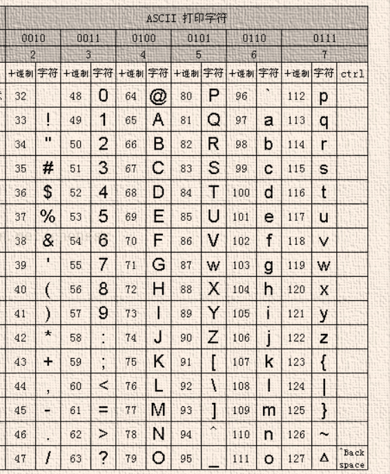

# 奇怪的东西

```python
import heapq
import collections

#1、写输入输出
nums = list(map(lambda x :int(x)-1, input().strip().split()))

str = "123abcrunoob3211212212"
print (str.strip( '12' ))  # 字符序列为 12
3abcrunoob3


map()
>>> list(map(lambda x: x ** 2, [1, 2, 3, 4, 5]))   # 使用 lambda 匿名函数
[1, 4, 9, 16, 25]

zip()


#2、常用奇怪的东西
ord("a")
97
chr(65)
A


#3、collections
collections.deque()
collections.dafalutdict(int,list........)
c = dict(collections.Counter('gallahad') )
{'a': 3, 'l': 2, 'g': 1, 'h': 1, 'd': 1}

#4、量级
pow(10,int(math.log(6324,10)))
1000


#6 nonlocal
def outer():
    num = 10
    def inner():
        # nonlocal 关键字
        nonlocal num
        num = 100
        print(num)
    inner()
    print(num)
outer()
输出100，100

#7 sort
connections.sort(key = lambda x:x[-1])
envelopes.sort(key=lambda x:(x[0],-x[1]))


#8random
random.choices(population,weights=None,*,cum_weights=None,k=1)


```




# 链表


##### 206. 反转链表

给你单链表的头节点 `head` ，请你反转链表，并返回反转后的链表。


链接：https://leetcode-cn.com/problems/reverse-linked-list


迭代

```python
# Definition for singly-linked list.
# class ListNode:
#     def __init__(self, val=0, next=None):
#         self.val = val
#         self.next = next
class Solution:
    def reverseList(self, head: ListNode) -> ListNode:
        cur = head
        pre = None
        while head:
            
            temp = head.next
            head.next = pre
            pre = head
            head = temp
            # pre,pre.next,head = head,pre,head.next 可写成一行
        return pre

```

递归

```python
# Definition for singly-linked list.
# class ListNode:
#     def __init__(self, val=0, next=None):
#         self.val = val
#         self.next = next
class Solution:
    def reverseList(self, head: ListNode) -> ListNode:
        if head==None or head.next==None:#head==0指的是输入的是一个空ListNode
            return head
        last = self.reverseList(head.next)
        head.next.next = head
        head.next = None
        return last
```


##### m. 反转前n个


```python
def reverseN(head, right):
    if right == 1:
        successor = head.next
        return head, successor
    last, successor = reverseN(head.next, right - 1)
    head.next.next = head
    head.next = successor
    return last, successor
```

如果是012345，n =3


##### 92. 反转链表 II


给你单链表的头指针 head 和两个整数 left 和 right ，其中 left <= right 。请你反转从位置 left 到位置 right 的链表节点，返回 反转后的链表 


链接：https://leetcode-cn.com/problems/reverse-linked-list-ii


###### 迭代

```python
# Definition for singly-linked list.
# class ListNode:
#     def __init__(self, val=0, next=None):
#         self.val = val
#         self.next = next
class Solution:
    def reverseBetween(self, head: ListNode, left: int, right: int) -> ListNode:
        newListNode = ListNode(next=head)
        res = newListNode
        for i in range(left-1):
            newListNode = newListNode.next
        prePointNeedReverse = newListNode
        pointNeedReverseStart = prePointNeedReverse.next

        pre = None
        for i in range(left,right+1):
            temp = pointNeedReverseStart.next
            pointNeedReverseStart.next =pre
            pre = pointNeedReverseStart
            pointNeedReverseStart = temp
        prePointNeedReverse.next.next = temp
        prePointNeedReverse.next = pre
        return res.next
```

###### 递归★★★★★

```python
class Solution:
    def reverseBetween(self, head: ListNode, left: int, right: int) -> ListNode:     
        if left == 1:
            return self.reverseN(head,right)[0]
        head.next = self.reverseBetween(head.next,left-1,right-1)
        return head  
    def reverseN(self,cur,n):
        if n == 1:
            successor = cur.next 
            return cur,successor
        last, successor = self.reverseN(cur.next,n-1)
        cur.next.next = cur
        cur.next = successor
        return last,successor  
```


##### k个一组反转链表


##### 剑指 Offer 22. 链表中倒数第k个节点

输入一个链表，输出该链表中倒数第k个节点。为了符合大多数人的习惯，本题从1开始计数，即链表的尾节点是倒数第1个节点。

来源：力扣（LeetCode）
链接：https://leetcode-cn.com/problems/lian-biao-zhong-dao-shu-di-kge-jie-dian-lcof
著作权归领扣网络所有。商业转载请联系官方授权，非商业转载请注明出处。


面试常考的简单题，思路：压栈 双指针 递归

```python
class Solution:
    def getKthFromEnd(self, head: ListNode, k: int) -> ListNode:
  
        #栈
        satck = []
        while head!=None:
            satck.append(head)
            head = head.next
        for i in range(k-1):
            satck.pop()
        return satck[-1]

        #递归
        global size
        if head == None or head.next==None:
            size= 1
            return head
        last = self.getKthFromEnd(head.next, k)
        size+=1
        if size == k:
            return head
        return last

        #双指针
        s, f = head, head
        for _ in range(k):
            if not f: return
            f = f.next
        while f:
            s, f = s.next, f.next
        return s
```


# 二叉树


##### 144.二叉树的前序遍历

前序遍历，递归

```python
class Solution:
    def preorderTraversal(self, root: TreeNode) -> List[int]:
        res =[]
        def dfs(root):
            nonlocal res
            if not root:
                return
            res.append(root.val)
            dfs(root.left)
            dfs(root.right)
        dfs(root)
        return res
```

​	模板

```python
class Solution:
    def preorderTraversal(self, root: TreeNode) -> List[int]:
        if not root:
            return []
        stack =[]
        res = []
        cur = root
        while cur or stack:
            while cur:
                res.append(cur.val)
                stack.append(cur)
                cur = cur.left
            temp = stack.pop()
            cur = temp.right
        return res
```

​	栈

```python
        if not root:
            return []
        stack =[]
        res = []
        cur = root
        while cur or stack:
            while cur:
                res.append(cur.val)
                stack.append(cur)
                cur = cur.left
            temp = stack.pop()
            cur = temp.right
        return res
```

##### 94. 二叉树的中序遍历

模板

```pytho
```


##### 226.翻转二叉树

```
class Solution:
    def invertTree(self, root: TreeNode) -> TreeNode:
        if not root :
            return
        root.left, root.right = root.right, root.left
        self.invertTree(root.left)
        self.invertTree(root.right)
        return root
```

##### 102.二叉树的层序遍历

BFS队列实现

```python
class Solution:
    def levelOrder(self, root: TreeNode) -> List[List[int]]:
        if not root:
            return []
        levelOrder=[]
        deque = collections.deque()
        deque.append(root)
        while deque:
            curLayer = []
            for i in range(len(deque)):
                curLayerNode = deque.popleft()
                curLayer.append(curLayerNode.val)
                if curLayerNode.left:
                    deque.append(curLayerNode.left)
                if curLayerNode.right:
                    deque.append(curLayerNode.right)
            levelOrder.append(curLayer)   
        return levelOrder
```

​	DFS

```python
```


##### 114. 二叉树展开为链表

给你二叉树的根结点 root ，请你将它展开为一个单链表：

展开后的单链表应该同样使用 TreeNode ，其中 right 子指针指向链表中下一个结点，而左子指针始终为 null 。
展开后的单链表应该与二叉树 先序遍历 顺序相同。


递归拉平，右边连接到左边，左边变成右边

```python
# Definition for a binary tree node.
# class TreeNode:
#     def __init__(self, val=0, left=None, right=None):
#         self.val = val
#         self.left = left
#         self.right = right
class Solution:
    def flatten(self, root: TreeNode) -> None:
        """
        Do not return anything, modify root in-place instead.
        """
        if root == None:
            return
        self.flatten(root.left)
        self.flatten(root.right)
        left = root.left
        right = root.right
        root.left = None
        root.right = left
        cur = root
        while cur.right:
            cur = cur.right
        cur.right = right
        return root
```


完全二叉树(Complete Binary Tree)：除了最后一层之外的其他每一层都被完全填充，并且所有结点都保持向**左对齐**。


满二叉树(Perfect Binary Tree)：除了叶子结点之外的每一个结点都有两个孩子，**每一层(当然包含最后一层)都被完全填充**。


完满二叉树(Full Binary Tree)：完满二叉树：**除了叶子结点之外的每一个结点都有两个孩子结点。**


# 堆

```python
# 最小堆完整代码
import heapq
# 新建一个列表
minHeap = []
# 将列表堆化，即将列表转换为最小堆
heapq.heapify(minHeap)
# 分别往最小堆中添加3，1，2
heapq.heappush(minHeap, 3)
heapq.heappush(minHeap, 1)
heapq.heappush(minHeap, 2)
# 查看最小堆的所有元素，结果为：[1,3,2]
print("minHeap: ",minHeap)
# 获取最小堆的堆顶元素
peekNum = minHeap[0]
# 结果为：1
print("peek number: ", peekNum)
# 删除最小堆的堆顶元素
popNum = heapq.heappop(minHeap)
# 结果为：1
print("pop number: ", popNum)
# 查看删除1后最小堆的堆顶元素，结果为：2
print("peek number: ", minHeap[0])
# 查看最小堆的所有元素，结果为：[2,3]
print("minHeap: ",minHeap)
# 获取堆的元素个数，即堆的长度
size = len(minHeap)
# 结果为：2
print("minHeap size: ", size)

```


# 排序

##### 912. 排序数组

给你一个整数数组 nums，请你将该数组升序排列。


链接：https://leetcode-cn.com/problems/sort-an-array


#### O(nlog(n))

##### 快速排序***

```python
d
```


##### 归并排序**


```python
def merge_sort(self,nums):
    if len(nums) == 1:
        return nums
    mid = len(nums)>>1
    left = self.merge_sort(nums[:mid])
    right = self.merge_sort(nums[mid:])
    return self.merge(left,right)

def merge(self,arr0,arr1):
    result = list()
    p = 0
    q = 0
    while len(arr0) > p and len(arr1) > q:
        if arr0[p] <= arr1[q]:
            result.append(arr0[p])
            p+=1
        else:
            result.append(arr1[q])
            q+=1
    result += arr0
    result += arr1
    return result
```


可用来求逆序对

##### 剑指 Offer 51. 数组中的逆序对

在数组中的两个数字，如果前面一个数字大于后面的数字，则这两个数字组成一个逆序对。输入一个数组，求出这个数组中的逆序对的总数。


链接：https://leetcode-cn.com/problems/shu-zu-zhong-de-ni-xu-dui-lcof


```python
class Solution:
    resN =0
    def reversePairs(self, nums: List[int]) -> int:
        if len(nums)<2:
            return 0
        self.merge_sort(nums)
        return self.resN
        
    def merge_sort(self,nums):
        if len(nums) == 1:
            return nums
        mid = len(nums) >> 1
        left = self.merge_sort(nums[:mid])
        right = self.merge_sort(nums[mid:])
        return self.merge(left, right)

    def merge(self,arr0, arr1):
        res = []
        result = []
        p = 0
        q = 0
        while len(arr0) > p and len(arr1) > q:
            if arr0[p] > arr1[q]:#<为正序对
                result.append(arr0[p])
                self.resN +=len(arr1)-q
                p += 1
            else:
                result.append(arr1[q])
                q += 1
        result += arr0[p:]
        result += arr1[q:]
        return result

```


##### 堆排序*

```python
d
```


#### O(n)

##### 桶排序*

```python
d
```


#### O(n2)

##### 插入排序*

选牌插入


```python
def insertion_sort(self, nums):
    n = len(nums)
    for i in range(1, n):
        while i > 0 and nums[i - 1] > nums[i]:
            nums[i - 1], nums[i] = nums[i], nums[i - 1]
            i -= 1
    return nums
```


##### 希尔排序【?】


```python
def shell_sort(self,nums):
    n = len(nums)
    gap = n>>1
    while gap:
        for i in range(gap, n):
            while i - gap >= 0 and nums[i - gap] > nums[i]:
                nums[i - gap], nums[i] = nums[i], nums[i - gap]
                i -= gap
        gap>>=1
    return nums
```


##### 选择排序

两个for选择最小值和前面交换


```python
def selection_sort(self,a):
    for i in range(0, len(a)-1):
        ith = i
        for j in range(i + 1, len(a)):
            if a[j] < a[ith]:
                ith = j
        a[i], a[ith] = a[ith], a[i]
    return a
```


##### 冒泡排序


```python
def maopao(self,a):
    flag = True
    while flag:
        flag = False
        for i in range(0, len(a)-1):
            if a[i] > a[i + 1]:
                flag = True
                a[i], a[i + 1] = a[i + 1], a[i]
    return a
```

##### 

# 单调栈

```python
insert x
while !sta.empty() && sta.top()<x
    sta.pop()
sta.push(x)
```

##### 84. 柱状图中最大的矩形[模板题]

给定 n 个非负整数，用来表示柱状图中各个柱子的高度。每个柱子彼此相邻，且宽度为 1 。

求在该柱状图中，能够勾勒出来的矩形的最大面积。

示例 1:


输入：heights = [2,1,5,6,2,3]
输出：10
解释：最大的矩形为图中红色区域，面积为 10

来源：力扣（LeetCode）
链接：https://leetcode-cn.com/problems/largest-rectangle-in-histogram
著作权归领扣网络所有。商业转载请联系官方授权，非商业转载请注明出处。


```python
class Solution:
    def largestRectangleArea(self, heights: List[int]) -> int:
        monotoneis = list()
        heights = [0] + heights +[0]
        res = 0
        for i in range(len(heights)):
            while monotoneis and heights[i] < heights[monotoneis[-1]]: 
                temp = monotoneis.pop()              
                res = max(res,(i-monotoneis[-1]-1)*heights[temp])
            monotoneis.append(i)
        return res
```


##### 85. 最大矩形

给定一个仅包含 0 和 1 、大小为 rows x cols 的二维二进制矩阵，找出只包含 1 的最大矩形，并返回其面积。

 

示例 1：


输入：matrix = [["1","0","1","0","0"],["1","0","1","1","1"],["1","1","1","1","1"],["1","0","0","1","0"]]
输出：6
解释：最大矩形如上图所示。

来源：力扣（LeetCode）
链接：https://leetcode-cn.com/problems/maximal-rectangle
著作权归领扣网络所有。商业转载请联系官方授权，非商业转载请注明出处。


统计每一列连续1的个数，通过单调栈求解可框选最大矩形面积

```python
class Solution:
    def maximalRectangle(self, matrix: List[List[str]]) -> int:
        m = len(matrix)
        if not m:
            return 0
        n = len(matrix[0])
        stack = [0 for _ in range(n+2)]
        res = 0
        for i in range(m):
            mo = []
            for j in range(n):
                if matrix[i][j] == '1':
                    stack[j+1] = stack[j+1]+1
                else:
                    stack[j+1]=0
            for j in range(n+2):
                while mo and stack[mo[-1]]>stack[j]:
                    temp = mo.pop()
                    res =max(res,(j-mo[-1]-1)*stack[temp])
                mo.append(j)
        return res
            
```


# 二分法


##### 327. 区间和的个数

给你一个整数数组 nums 以及两个整数 lower 和 upper 。求数组中，值位于范围 [lower, upper] （包含 lower 和 upper）之内的 区间和的个数 。

区间和 S(i, j) 表示在 nums 中，位置从 i 到 j 的元素之和，包含 i 和 j (i ≤ j)。

 

示例 1：
输入：nums = [-2,5,-1], lower = -2, upper = 2
输出：3
解释：存在三个区间：[0,0]、[2,2] 和 [0,2] ，对应的区间和分别是：-2 、-1 、2 。

来源：力扣（LeetCode）
链接：https://leetcode-cn.com/problems/count-of-range-sum
著作权归领扣网络所有。商业转载请联系官方授权，非商业转载请注明出处。


通过这题理解一下前缀和和二分

```python
class Solution:
    def countRangeSum(self, nums: List[int], lower: int, upper: int) -> int:
        
        res = 0 
        preSum = [0]
        cur = 0
        for i in range(len(nums)):
            cur+=nums[i]
            l =l1 =l2=  0
            r = r1 =r2= len(preSum)
            upLimit = cur-upper
            lowLimit = cur-lower
            while l<r:
                mid =l+((r-l)>>1)
                if upLimit>preSum[mid]:
                    l = mid+1
                else:
                    r = mid          
            while l1<r1:
                mid =l1+((r1-l1)>>1)
                if lowLimit>=preSum[mid]:
                    l1 = mid+1
                else:
                    r1 = mid
            res += l1-l
            while l2<r2:
                mid =l2+((r2-l2)>>1)
                if cur>preSum[mid]:
                    l2 = mid+1
                else:
                    r2 = mid
            preSum.insert(l2,cur)
        return res

```


# 回溯, DFS

```python
result = []
def backtrack(路径, 选择列表):
    if 满足结束条件:
        result.add(路径)
        return

    for 选择 in 选择列表:
        判断然后做选择
        backtrack(路径, 选择列表)
        撤销选择[状态重置]
```


##### 47. 全排列 II [回溯模板题]

给定一个可包含重复数字的序列 nums ，按任意顺序 返回所有不重复的全排列。

示例 1：

输入：nums = [1,1,2]
输出：
[[1,1,2],
 [1,2,1],
 [2,1,1]]

来源：力扣（LeetCode）
链接：https://leetcode-cn.com/problems/permutations-ii
著作权归领扣网络所有。商业转载请联系官方授权，非商业转载请注明出处。

```python
class Solution:
    def permuteUnique(self, nums: List[int]) -> List[List[int]]:
        if not nums: return []
        res = []
        used = [0] * len(nums)
        def backtracking(nums, used, path):
            # 终止条件
            if len(path) == len(nums):
                res.append(path.copy())
                return
            for i in range(len(nums)):
                if not used[i]:
                    if i>0 and nums[i] == nums[i-1] and not used[i-1]:
                        continue
                    used[i] = 1
                    path.append(nums[i])                   
                    backtracking(nums, used, path)                   
                    path.pop()
                    used[i] = 0
        backtracking(sorted(nums),used,[])
        return res
```


# 双指针 三指针

##### keyword:原地移动


##### 26.删除有序数组中的重复项

给你一个有序数组 nums ，请你 原地 删除重复出现的元素，使每个元素 只出现一次 ，返回删除后数组的新长度。不要使用额外的数组空间，你必须在 原地 修改输入数组 并在使用 O(1) 额外空间的条件下完成。


链接：https://leetcode-cn.com/problems/remove-duplicates-from-sorted-array


```python
class Solution:
    def removeDuplicates(self, nums: List[int]) -> int:
        n = len(nums)
        if n ==1:
            return 1
        j = 1
        for i in range(1,n):
            if nums[i] != nums[j-1]:
                nums[j] = nums[i]    
                j += 1
        return j 
```


##### 80. 删除有序数组中的重复项 II

给你一个有序数组 nums ，请你 原地 删除重复出现的元素，使每个元素 最多出现两次 ，返回删除后数组的新长度。不要使用额外的数组空间，你必须在 原地 修改输入数组 并在使用 O(1) 额外空间的条件下完成。


链接：https://leetcode-cn.com/problems/remove-duplicates-from-sorted-array-ii


````python
class Solution:
    def removeDuplicates(self, nums: List[int]) -> int:
        n = len(nums)
        if n<3:
            return n
        slow = 2
        for fast in range(2,len(nums)): 
            if  nums[fast]!= nums[slow-2]:   
                nums[slow] = nums[fast]
                slow+=1
        return slow
    
# 	class Solution:
#     def removeDuplicates(self, nums: List[int]) -> int:
#         n = len(nums)
#         slow = 0
#         for fast in range(0,len(nums)): 
#             if  slow<2 or nums[fast]!= nums[slow-2]:   
#                 nums[slow] = nums[fast]
#                 slow+=1
#         return slow
````

##### 75. 颜色分类

给定一个包含红色、白色和蓝色，一共 n 个元素的数组，原地对它们进行排序，使得相同颜色的元素相邻，并按照红色、白色、蓝色顺序排列。

此题中，我们使用整数 0、 1 和 2 分别表示红色、白色和蓝色。


链接：https://leetcode-cn.com/problems/sort-colors


经典三指针。

```python
class Solution:
    def sortColors(self, nums: List[int]) -> None:
        """
        Do not return anything, modify nums in-place instead.
        """
        N = len(nums)
        l = 0
        r = N-1
        i = 0
        while r>=i:
            if nums[i] == 0:
                nums[l], nums[i] = nums[i], nums[l]
                l+=1
            if nums[i] == 2:
                nums[r], nums[i] = nums[i], nums[r]
                r-=1
                continue
            i+=1
        return nums
```


##### 1. 两数之和[超级简单题]

给定一个整数数组 nums 和一个整数目标值 target，请你在该数组中找出 和为目标值 target  的那 两个 整数，并返回它们的数组下标。

你可以假设每种输入只会对应一个答案。但是，数组中同一个元素在答案里不能重复出现。

你可以按任意顺序返回答案。


链接：https://leetcode-cn.com/problems/two-sum


```python
class Solution:
    def twoSum(self, nums: List[int], target: int) -> List[int]:
        nums_o = nums.copy()
        nums.sort()
        l = 0
        r = len(nums)-1
        res = []
        while l<r:
            if nums[l]+nums[r] > target:
                r-=1
            elif nums[l]+nums[r] < target:
                l+=1
            else:
                for i in range(len(nums)):
                    if nums_o[i] == nums[l] or nums_o[i] == nums[r]:
                        res.append(i)
                return res
```


##### 15.三数之和

给你一个包含 n 个整数的数组 nums，判断 nums 中是否存在三个元素 a，b，c ，使得 a + b + c = 0 ？请你找出所有和为 0 且不重复的三元组。

注意：答案中不可以包含重复的三元组。


链接：https://leetcode-cn.com/problems/3sum


```python
class Solution:
    def threeSum(self, nums: List[int]) -> List[List[int]]:
        res = []
        nums.sort()
        N = len(nums)
        if N<3:
            return []
        for i in range(N-2):
            if nums[i]<=0:

                if i>0 and nums[i] == nums[i-1]:#[-1,0,1,2,-1,-4] 只找第一个-1就可
                    continue
                l = i+1
                r = N-1
                target = -nums[i]
                while l<r:
                    if nums[l]+nums[r]>target:
                        r-=1
                    elif nums[l]+nums[r]<target:
                        l+=1
                    else:
                        res.append([nums[i],nums[l],nums[r]])
                        while l<r and nums[l] ==  nums[l+1]: #[-4,1,1,1,3,3,3,3]
                            l+=1
                        while l<r and nums[r] ==  nums[r-1]:
                            r-=1  
                        l+=1
                        r-=1         
            else:
                break
        return res 
```


##### 18.四数之和

给你一个由 n 个整数组成的数组 nums ，和一个目标值 target 。请你找出并返回满足下述全部条件且不重复的四元组 [nums[a], nums[b], nums[c], nums[d]] ：

0 <= a, b, c, d < n
a、b、c 和 d 互不相同
nums[a] + nums[b] + nums[c] + nums[d] == target
你可以按 任意顺序 返回答案 。

 


链接：https://leetcode-cn.com/problems/4sum


```python
class Solution:
    def fourSum(self, nums: List[int], target: int) -> List[List[int]]:
        n = len(nums)
        if n < 4: return []
        nums.sort()
        res = []
        for i in range(n-3):
            # 防止重复 数组进入 res
            if i > 0 and nums[i] == nums[i-1]:
                continue
            # 当数组最小值和都大于target 跳出
            if nums[i] + nums[i+1] + nums[i+2] + nums[i+3] > target:
                break
            # 当数组最大值和都小于target,说明i这个数还是太小,遍历下一个
            if nums[i] + nums[n-1] + nums[n-2] + nums[n-3] < target:
                continue
            for j in range(i+1,n-2):
                # 防止重复 数组进入 res
                if j - i > 1 and nums[j] == nums[j-1]:
                    continue
                # 同理
                if nums[i] + nums[j] + nums[j+1] + nums[j+2] > target:
                    break
                # 同理
                if nums[i] + nums[j] + nums[n-1] + nums[n-2] < target:
                    continue
                # 双指针
                left = j + 1
                right = n - 1
                while left < right:
                    tmp = nums[i] + nums[j] + nums[left] + nums[right]
                    if tmp == target:
                        res.append([nums[i],nums[j],nums[left],nums[right]])
                        while left < right and nums[left] == nums[left+1]:
                            left += 1
                        while left < right and nums[right] == nums[right-1]:
                            right -= 1
                        left += 1
                        right -= 1
                    elif tmp > target:
                        right -= 1
                    else:
                        left += 1
        return res
```

##### 633.平方数之和

给定一个非负整数 c ，你要判断是否存在两个整数 a 和 b，使得 a2 + b2 = c 。


链接：https://leetcode-cn.com/problems/sum-of-square-numbers


```python
class Solution:
    def judgeSquareSum(self, c: int) -> bool:       
        l = 0 
        r = int(c**0.5)
        while l<=r:
            cur = l*l+r*r
            if cur == c:
                return True    
            elif cur<c:
                l+=1
            else:
                r-=1          
        return False

```


##### 548. 将数组分割成和相等的子数组

给定一个有 n 个整数的数组，你需要找到满足以下条件的三元组 (i, j, k) ：

0 < i, i + 1 < j, j + 1 < k < n - 1
子数组 (0, i - 1)，(i + 1, j - 1)，(j + 1, k - 1)，(k + 1, n - 1) 的和应该相等。
这里我们定义子数组 (L, R) 表示原数组从索引为L的元素开始至索引为R的元素。

来源：力扣（LeetCode）
链接：https://leetcode-cn.com/problems/split-array-with-equal-sum
著作权归领扣网络所有。商业转载请联系官方授权，非商业转载请注明出处。


求完前缀和后三个指针动呀动

```python
class Solution:
    def splitArray(self, nums: List[int]) -> bool:
        #找个三个分界线将原先数组分割成为四个等和
        N = len(nums)
        if N<7:
            return False
        preSum = [0]*(N+1)
        for i in range(N):
            preSum[i+1] = preSum[i]+nums[i]
        for M in range(3,N-3):
            memo = set()
            for L in range(1,M-1):
                sumCL = preSum[L]
                sumLM = preSum[M] - preSum[L+1]
                if sumCL == sumLM:
                    memo.add(sumLM)
            for R in range(M+2,N-1):
                sumMR = preSum[R]-preSum[M+1]
                sumRV = preSum[N]-preSum[R+1]
                if sumMR==sumRV and sumRV in memo:
                    return True
        return False
```


# 快慢指针


**slow 是.next跑s，fast是.next.next 跑2s， fast比slow多跑了n个环**
$$
2s = s+nb
—>s =nb
$$
**可得slow跑的距离是n个环，又a+nb肯定在入环口，所以slow再跑a就到环口，即来个新的指针从头开始跑a就到环口和slow相遇**

------


##### 142.环形链表 II

给定一个链表，返回链表开始入环的第一个节点。 如果链表无环，则返回 null。

为了表示给定链表中的环，我们使用整数 pos 来表示链表尾连接到链表中的位置（索引从 0 开始）。 如果 pos 是 -1，则在该链表中没有环。注意，pos 仅仅是用于标识环的情况，并不会作为参数传递到函数中。

说明：不允许修改给定的链表。

进阶：

你是否可以使用 O(1) 空间解决此题？


链接：https://leetcode-cn.com/problems/linked-list-cycle-ii


```python
# Definition for singly-linked list.
# class ListNode:
#     def __init__(self, x):
#         self.val = x
#         self.next = None

class Solution:
    def detectCycle(self, head: ListNode) -> ListNode:
        
        if head ==None or head.next==None:
            return 
            
        slow = head
        fast = head
        headNew = head
        while  fast.next and fast.next.next:
            slow = slow.next
            fast= fast.next.next
            if slow == fast:
                while slow!=headNew:
                    headNew = headNew.next
                    slow = slow.next
                return headNew
```


##### 287. 寻找重复数

给定一个包含 n + 1 个整数的数组 nums ，其数字都在 1 到 n 之间（包括 1 和 n），可知至少存在一个重复的整数。

假设 nums 只有 一个重复的整数 ，找出 这个重复的数 。

你设计的解决方案必须不修改数组 nums 且只用常量级 O(1) 的额外空间。

 


链接：https://leetcode-cn.com/problems/find-the-duplicate-number


```python
class Solution:
    def findDuplicate(self, nums: List[int]) -> int:

        slow = 0
        fast = 0
        while slow != fast or slow==0:
            slow = nums[slow]
            fast = nums[nums[fast]]
        fast = 0
        while fast != slow:
            slow = nums[slow]
            fast = nums[fast]
        return slow
```


# 滑动窗口（双指针）

##### keyword：子组串，在一个范围内操作

```python
l = 0
for r in range(N): #右指针移动
    windowscalculate and other #计算统计的东西 
    while condition: #当不符合情况时，左指针移动
        change windoes until OK #修改直到OK，记得windoes里面也要修改
    	l+=1
```


##### 3. 无重复字符的最长子串[滑窗模板题]

给定一个字符串 `s` ，请你找出其中不含有重复字符的 **最长子串** 的长度。


链接：https://leetcode-cn.com/problems/longest-substring-without-repeating-characters


```python
class Solution:
    def lengthOfLongestSubstring(self, s: str) -> int:
        N = len(s)
        l = 0
        res = 0
        dictStat =collections.defaultdict(int)
        for r in range(N):
            dictStat[s[r]]+=1
            while dictStat[s[r]] ==2:     
                dictStat[s[l]]-=1
                l+=1
            res = max(res,r-l+1)
        return res
```


##### 340. 至多包含 K 个不同字符的最长子串

给定一个字符串 ***`s`\*** ，找出 **至多** 包含 *`k`* 个不同字符的最长子串 ***T\***。


链接：https://leetcode-cn.com/problems/longest-substring-with-at-most-k-distinct-characters


维护一个hashmap存储字符出现次数

```python
class Solution:
    def lengthOfLongestSubstringKDistinct(self, s: str, k: int) -> int:
        N = len(s)
        if N<k+1:
            return N
        l = 0
        res = 0
        dictS = collections.defaultdict(int)
        for r in range(N):
            dictS[s[r]]+=1
            while len(dictS)==k+1:
                dictS[s[l]]-=1
                if dictS[s[l]] == 0:
                    del dictS[s[l]]
                l+=1             
            res= max(res,r-l+1)
        return res
```


##### 1838. 最高频元素的频数

元素的 频数 是该元素在一个数组中出现的次数。

给你一个整数数组 nums 和一个整数 k 。在一步操作中，你可以选择 nums 的一个下标，并将该下标对应元素的值增加 1 。

执行最多 k 次操作后，返回数组中最高频元素的 最大可能频数 。


链接：https://leetcode-cn.com/problems/frequency-of-the-most-frequent-element


经典滑动窗口模板题，比较大小求左指针，右指针一直往右

```python
class Solution:
    def maxFrequency(self, nums: List[int], k: int) -> int:
        res = 0
        N = len(nums)
        nums.sort()
        l = 0 
        windowsSum = 0
        for r in range(N):
            windowsSum += nums[r]
            while windowsSum+k <(r-l+1)*nums[r]:
                windowsSum-=nums[l]
                l+=1
            res = max(res,r-l+1)
        return res
    
```


##### 424. 替换后的最长重复字符

给你一个仅由大写英文字母组成的字符串，你可以将任意位置上的字符替换成另外的字符，总共可最多替换 k 次。在执行上述操作后，找到包含重复字母的最长子串的长度。

注意：字符串长度 和 k 不会超过 104。


链接：https://leetcode-cn.com/problems/longest-repeating-character-replacement


```python
class Solution:
    def characterReplacement(self, s: str, k: int) -> int:
        res = 0
        l = 0
        N = len(s)
        tempDict = collections.defaultdict(int)
        for r in range(N):
            tempDict[s[r]]+=1
            while r-l+1-max(tempDict.values())>k: 
                tempDict[s[l]]-=1
                l+=1
            res = max(res,r-l+1)
        return res
        
```


##### 1423.可获得的最大点数

几张卡牌 排成一行，每张卡牌都有一个对应的点数。点数由整数数组 cardPoints 给出。

每次行动，你可以从行的开头或者末尾拿一张卡牌，最终你必须正好拿 k 张卡牌。

你的点数就是你拿到手中的所有卡牌的点数之和。

给你一个整数数组 cardPoints 和整数 k，请你返回可以获得的最大点数。


链接：https://leetcode-cn.com/problems/maximum-points-you-can-obtain-from-cards


```python
class Solution:
    def maxScore(self, cardPoints: List[int], k: int) -> int:
        
        l = 0   
        N = len(cardPoints)
        sumValue = sum(cardPoints[:k])
        res = sumValue 
        for r in range(k-1,-1,-1):
            sumValue -= cardPoints[r]
            r-=1
            l-=1
            sumValue +=cardPoints[l]
            res = max(res,sumValue)
        return res
        
```


##### 713. 乘积小于K的子数组

给定一个正整数数组 nums和整数 k 。

请找出该数组内乘积小于 k 的连续的子数组的个数。


链接：https://leetcode-cn.com/problems/subarray-product-less-than-k


```python
class Solution:
    def numSubarrayProductLessThanK(self, nums: List[int], k: int) -> int:
        if k <=1:
            return 0
        l =0
        N = len(nums)
        windowsValue = 1
        res = 0
        for r in range(N):
            windowsValue *= nums[r]
            while windowsValue>=k:
                windowsValue = int(windowsValue/nums[l])
                l+=1
            res += r-l+1
        return res
            


```


### 队列

##### 346.数据流中的移动平均值[超级简单题]

给定一个整数数据流和一个窗口大小，根据该滑动窗口的大小，计算其所有整数的移动平均值。

实现 MovingAverage 类：

MovingAverage(int size) 用窗口大小 size 初始化对象。
double next(int val) 计算并返回数据流中最后 size 个值的移动平均值。


链接：https://leetcode-cn.com/problems/moving-average-from-data-stream


```python
class MovingAverage:

    def __init__(self, size: int):
        self.size = size
        self.deque = collections.deque()
        self.windowsSum = 0
        self.count = 0

        """
        Initialize your data structure here.
        """

    def next(self, val: int) -> float:
        
        self.deque.append(val)
        self.count+=1
        
        if self.count >self.size:
            popleft = self.deque.popleft()
        else:
            popleft = 0
        self.windowsSum = self.windowsSum-popleft+val
        return self.windowsSum/min(self.size,self.count)
```


### 单调队列


##### 剑指 Offer 59 - II. 队列的最大值

请定义一个队列并实现函数 max_value 得到队列里的最大值，要求函数max_value、push_back 和 pop_front 的均摊时间复杂度都是O(1)。

若队列为空，pop_front 和 max_value 需要返回 -1


链接：https://leetcode-cn.com/problems/dui-lie-de-zui-da-zhi-lcof


```python
class MaxQueue:
    def __init__(self):
        self.deque0 = collections.deque()
        self.deque1 = collections.deque()
    def max_value(self):
        return self.deque1[0] if self.deque1 else -1

    def push_back(self,x):
        self.deque0.append(x)
        while self.deque1 and self.deque1[-1]<x:
            self.deque1.pop()
        self.deque1.append(x)
    def pop_front(self):
        if not self.deque0:
            return -1
        a = self.deque0.popleft()
        if a == self.deque1[0]:
            self.deque1.popleft()
        return a

```


### 滑动窗口+队列


##### 239. 滑动窗口最大值

给你一个整数数组 nums，有一个大小为 k 的滑动窗口从数组的最左侧移动到数组的最右侧。你只可以看到在滑动窗口内的 k 个数字。滑动窗口每次只向右移动一位。

返回滑动窗口中的最大值。


链接：https://leetcode-cn.com/problems/sliding-window-maximum


维护一个单调递减的单调队列，当左边pop掉的时候，检查队头是否也应该pop

```python
class Solution:
    def maxSlidingWindow(self, nums: List[int], k: int) -> List[int]:
          
        N = len(nums)
        if N<2:
            return nums
        deque = collections.deque()
        res = [0]*(N-k+1)
        for r in range(N):
            while deque and nums[deque[-1]]<nums[r]:
                deque.pop()
            deque.append(r)
            if r-k+1 > deque[0]: #可以while r-k+1 > deque[0]:
                deque.popleft()
            if r >= k-1:
                res[r-k+1] = nums[deque[0]]
        return res
    
     	# #暴力
        # res = []
        # N = len(nums)
        # if k==0:
        #     return []
        # for l in range(N-k+1):
        #     res.append(max(nums[l:l+k]))
        # return res
```


##### 1438. 绝对差不超过限制的最长连续子数组

给你一个整数数组 nums ，和一个表示限制的整数 limit，请你返回最长连续子数组的长度，该子数组中的任意两个元素之间的绝对差必须小于或者等于 limit 。

如果不存在满足条件的子数组，则返回 0 。


链接：https://leetcode-cn.com/problems/longest-continuous-subarray-with-absolute-diff-less-than-or-equal-to-limit


```python
class Solution:
    def longestSubarray(self, nums: List[int], limit: int) -> int:
        l = 0
        res = 0
        N = len(nums)
        dequeMax = collections.deque()
        dequeMin = collections.deque()
        for r in range(N):
            while dequeMax and nums[r]>nums[dequeMax[-1]]:
                dequeMax.pop()
            while dequeMin and nums[r]<nums[dequeMin[-1]]:
                dequeMin.pop()
            dequeMin.append(r)
            dequeMax.append(r)
            while nums[dequeMax[0]] - nums[dequeMin[0]]>limit:
                if l == dequeMax[0]:
                    dequeMax.popleft()
                if l == dequeMin[0]:
                    dequeMin.popleft()
                l+=1
            res = max(res,r-l+1)
        return res
            
```


# 前缀和

**keyword：和，连续子数组**

**哈希表存储前缀和**出现次数


##### 209. 长度最小的子数组

给定一个含有 n 个正整数的数组和一个正整数 target 。

找出该数组中满足其和 ≥ target 的长度最小的 连续子数组 [numsl, numsl+1, ..., numsr-1, numsr] ，并返回其长度。如果不存在符合条件的子数组，返回 0 。


链接：https://leetcode-cn.com/problems/minimum-size-subarray-sum

```python
class Solution:
    def minSubArrayLen(self, target: int, nums: List[int]) -> int:
       

        if not nums : 
            return 0
        N = len(nums)
        for i in range(1, N):
            nums[i] += nums[i - 1]
        if nums[-1]<target:
            return 0
        nums = [0]+nums
        res = float("inf")
        for i in range(N+1):
            targetAdd = nums[i]+target
            l = i+1
            r = N+1
            while l<r:
                mid = l+((r-l)>>1)
                if targetAdd>nums[mid]:
                    l = mid+1
                else:
                    r = mid
            if l == N+1:
                continue
            else:
                res = min(res,l-i)
        return res
    
    	#用双指针好点
     	# l =  0
        # sumResult = 0
        # res = float("inf")
        # for r in range(len(nums)):
        #     sumResult += nums[r]
        #     while sumResult >= target:
        #         res = min(res, r+1-l)
        #         sumResult -= nums[l]
        #         l +=1
        # if res == float("inf"):
        #     return 0
        # else:
        #     return res
```


##### 560. 和为K的子数组[经典题]

给定一个整数数组和一个整数 **k，**你需要找到该数组中和为 **k** 的连续的子数组的个数。

示例 1 :

输入:nums = [-1,2,7,-3,8,5], k = 5
输出: 3 

来源：力扣（LeetCode）
链接：https://leetcode-cn.com/problems/subarray-sum-equals-k
著作权归领扣网络所有。商业转载请联系官方授权，非商业转载请注明出处。


经典前缀和题目，**哈希表存储前缀和**出现次数

```python
class Solution:
    def subarraySum(self, nums: List[int], k: int) -> int:
        num_times = collections.defaultdict(int)
        num_times[0] = 1  # 先给定一个初始值，代表前缀和为0的出现了一次
        cur_sum = 0  # 记录到当前位置的前缀和
        res = 0
        for i in range(len(nums)):
            cur_sum += nums[i]  # 计算当前前缀和
            if cur_sum - k in num_times:  # 如果前缀和减去目标值k所得到的值在字典中出现，即当前位置前缀和减去之前某一位的前缀和等于目标值
                res += num_times[cur_sum - k]    
            num_times[cur_sum] += 1
        return res
```


### 前缀和+队列

##### 862. 和至少为 K 的最短子数组

返回 A 的最短的非空连续子数组的长度，该子数组的和至少为 K 。

如果没有和至少为 K 的非空子数组，返回 -1 。

链接：https://leetcode-cn.com/problems/shortest-subarray-with-sum-at-least-k


求前缀和，在前缀和List中找到后一个减去前一个>=k的最短长度，只需要维护一个单调队列即可

```python
class Solution:
    def shortestSubarray(self, nums: List[int], k: int) -> int:
        #求前缀和
        res = float("inf")
        N = len(nums)
        for i in range(1,N):
            nums[i] += nums[i-1]
        nums = [0]+nums
        dequeMin = collections.deque()
        for r in range(N+1):   
            while dequeMin and nums[r]<nums[dequeMin[-1]]:
                dequeMin.pop()
            dequeMin.append(r)  
            while dequeMin and nums[r] - nums[dequeMin[0]] >= k:
                res = min(res,r-dequeMin.popleft())
        return -1 if res == float("inf") else res
```


### 二维前缀和


##### 304. 二维区域和检索 - 矩阵不可变[基础知识]

给定一个二维矩阵 matrix，以下类型的多个请求：

计算其子矩形范围内元素的总和，该子矩阵的左上角为 (row1, col1) ，右下角为 (row2, col2) 。
实现 NumMatrix 类：

NumMatrix(int[][] matrix) 给定整数矩阵 matrix 进行初始化
int sumRegion(int row1, int col1, int row2, int col2) 返回左上角 (row1, col1) 、右下角 (row2, col2) 的子矩阵的元素总和。

来源：力扣（LeetCode）
链接：https://leetcode-cn.com/problems/range-sum-query-2d-immutable
著作权归领扣网络所有。商业转载请联系官方授权，非商业转载请注明出处。


两种处理方法：

```python
class NumMatrix:

    def __init__(self, matrix: List[List[int]]):
        m = len(matrix)
        n = len(matrix[0])
        self.presumTwo = [[0 for _ in range(n+1)] for _ in range(m+1)]
        for i in range(1,m+1):
            for j in range(1,n+1):
                self.presumTwo[i][j] = matrix[i-1][j-1]+self.presumTwo[i-1][j]+self.presumTwo[i][j-1]-self.presumTwo[i-1][j-1]
        
    def sumRegion(self, row1: int, col1: int, row2: int, col2: int) -> int:
            #对于presumTwo里面对应位置为+1
        return self.presumTwo[row2+1][col2+1]-self.presumTwo[row1][col2+1]-self.presumTwo[row2+1][col1]+self.presumTwo[row1][col1]
```

```python
class NumMatrix:

    def __init__(self, matrix: List[List[int]]):
        m = len(matrix)
        n =len(matrix[0])
        sum = [[0 for j in range(n)] for i in range(m)]
        for i in range(m):
            for j in range(n):
                if  i==0 and j!=0:
                    sum[i][j] = matrix[i][j] + 0 + sum[i][j - 1] - 0
                elif i!=0 and j == 0:
                    sum[i][j] = matrix[i][j] + sum[i - 1][j] + 0 - 0
                elif i == 0 and j==0:
                    sum[i][j] = matrix[i][j]
                else:
                    sum[i][j] = matrix[i][j] + sum[i - 1][j] + sum[i][j - 1] - sum[i - 1][j - 1]
        self.sum = sum
        


    def sumRegion(self, row1: int, col1: int, row2: int, col2: int) -> int:
            if row1==0 and col1==0:
                return self.sum[row2][col2]
            elif row1!=0 and col1 ==0:
                return self.sum[row2][col2]-self.sum[row1-1][col2]-0+0
            elif row1==0 and col1!=0:
                return self.sum[row2][col2]-0-self.sum[row2][col1-1]+0
            else:
                return self.sum[row2][col2]-self.sum[row1-1][col2]-self.sum[row2][col1-1]+self.sum[row1-1][col1-1]

```


# 图

学习资料：

https://leetcode-cn.com/leetbook/read/graph/rqu5q7/


### 并查集

```python
def find(x):
    if x == root[x]:
        return x
    root[x] = find(root[x])
    return root[x]
def union(x,y):  
	root[find(x)] = find(y)
```


##### 547.省份数量（中等）

有 n 个城市，其中一些彼此相连，另一些没有相连。如果城市 a 与城市 b 直接相连，且城市 b 与城市 c 直接相连，那么城市 a 与城市 c 间接相连。

省份 是一组直接或间接相连的城市，组内不含其他没有相连的城市。

给你一个 n x n 的矩阵 isConnected ，其中 isConnected[i][j] = 1 表示第 i 个城市和第 j 个城市直接相连，而 isConnected[i][j] = 0 表示二者不直接相连。

返回矩阵中 省份 的数量。


链接：https://leetcode-cn.com/problems/number-of-provinces


```python
class Solution:
    def findCircleNum(self, isConnected: List[List[int]]) -> int:
        pNums = len(isConnected)
        root = [i for i in range(pNums)]       
        def find(x):
            if x == root[x]:
                return x
            root[x] = find(root[x])
            return root[x]
        def union(x,y):  
            root[find(x)] = find(y)
        for i in range(pNums):
            for j in range(i):
                if isConnected[i][j]:
                    union(i,j)
        return sum(root[i] ==i for i in range(pNums))
                
        # pNums = len(isConnected)
        # root = [i for i in range(pNums)]
        # rank = [1 for i in range(pNums)]
        # def find(x):
        #     if x == root[x]:
        #         return x
        #     root[x] = find(root[x])
        #     return root[x]
        # def union(x,y):  
        #     if rank[find(x)]>rank[find(y)]:
        #         root[find(y)] = find(x)
        #     elif rank[find(x)]<rank[find(y)]:
        #         root[find(x)] = find(y)
        #     else:
        #         root[find(x)] = find(y)
        #         rank[x]+=1                 
        # for i in range(pNums):
        #     find(i)
        # print(root)
        # return len(set(root))
```


##### 1202.交换字符串中的元素（中等）*

给你一个字符串 s，以及该字符串中的一些「索引对」数组 pairs，其中 pairs[i] = [a, b] 表示字符串中的两个索引（编号从 0 开始）。

你可以 任意多次交换 在 pairs 中任意一对索引处的字符。

返回在经过若干次交换后，s 可以变成的按字典序最小的字符串。


链接：https://leetcode-cn.com/problems/smallest-string-with-swaps


```python
class Solution:
    def smallestStringWithSwaps(self, s: str, pairs: List[List[int]]) -> str:
        
        ans = list()
        sLen = len(s)
        root = [i for i in range(sLen)]
        def find(x):
            if root[x] == x:
                return x
            root[x] = find(root[x])
            return root[x]
        def union(x,y):
            root[find(x)] = find(y)
            
        for i in range(len(pairs)):
            union(pairs[i][0],pairs[i][1])
        reDict= collections.defaultdict(list)
        for i in range(sLen):
            reDict[find(i)].append(s[i])
        print(reDict)
        for charList in reDict.values():
            charList.sort(reverse = True)
        for i in range(sLen):
            ans.append(reDict[find(i)].pop())
        return "".join(ans)
```


### 最小生成树【prim算法还没写】


Kruskal算法：按照权重排序，如果成环[即并查集中find(x) == find(y)]跳过，n-1条连接结束

Prim算法：贪心，顶点为主导，加入未加入的顶点里面和加入的顶点里面的最小值

Kruskal算法时间复杂度为O(M*log(M)), M为边数, 适合于稀疏图；Prim算法的时间复杂度为O(N^2), N为顶点数量, 适合于稠密图或完全图


##### 1135.最低成本联通所有城市（中等）

想象一下你是个城市基建规划者，地图上有 N 座城市，它们按以 1 到 N 的次序编号。

给你一些可连接的选项 conections，其中每个选项 conections[i] = [city1, city2, cost] 表示将城市 city1 和城市 city2 连接所要的成本。（连接是双向的，也就是说城市 city1 和城市 city2 相连也同样意味着城市 city2 和城市 city1 相连）。

返回使得每对城市间都存在将它们连接在一起的连通路径（可能长度为 1 的）最小成本。该最小成本应该是所用全部连接代价的综合。如果根据已知条件无法完成该项任务，则请你返回 -1。

 

示例 1：


输入：N = 3, conections = [[1,2,5],[1,3,6],[2,3,1]]
输出：6
解释：
选出任意 2 条边都可以连接所有城市，我们从中选取成本最小的 2 条。


链接：https://leetcode-cn.com/problems/connecting-cities-with-minimum-cost


经典最小生成树，Kruskal算法：

```python
class Solution:
    def minimumCost(self, n: int, connections: List[List[int]]) -> int:
        RES = 0
        COUNT = 0
        root = [i for i in range(n+1)]
        #find()别写错了
        def find(x):
            if x == root[x]:
                return x
            root[x] = find(root[x])
            return root[x]
            
        def union(x,y):
            root[find(x)] = find(y)

        def isnotConnect(x,y):
            return find(x) != find(y)

        connections.sort(key = lambda x:x[-1])

        for i in range(len(connections)):
            if isnotConnect(connections[i][0],connections[i][1]):
                union(connections[i][0],connections[i][1])
                RES+=connections[i][2]
                COUNT+=1
                if COUNT == n-1:
                    return RES
        return -1
```


##### 1584.连接所有点的最小费用（中等）


经典最小生成树，Kruskal算法：

```python
class Solution:
    def minCostConnectPoints(self, points: List[List[int]]) -> int:    
        N = len(points)
        root = [i for i in range(N)]
        dis = []
        for i in range(N):
            for j in range(i+1,N):
                dis.append([i,j,abs(points[i][0]-points[j][0])+abs(points[i][1]-points[j][1])])
        dis.sort(key=lambda x:x[-1])

        def find(x):
            if x == root[x]:
                return x
            root[x] = find(root[x])
            return root[x]
        def union(x,y):
            root[find(x)] = find(y)
        def canConnect(x,y):
            return find(x) != find(y)
        res =0
        COUNT=0
        for i in range(len(dis)):
            if canConnect(dis[i][0],dis[i][1]):
                union(dis[i][0],dis[i][1])
                res+=dis[i][2] 
                COUNT+=1
                if COUNT == N-1:
                    break 
        return res
```


### 单源最短路径相关算法[加权图路径]


Dijkstra 算法，Bellman-Ford 算法


##### 拓扑排序之 Kahn 算法


# DP


### 背包问题

#背包九讲pdf & https://www.bilibili.com/video/BV1qt411Z7nE

#### 01背包：

每种物品仅有一件，可以选择放或不放。
$$
dp[i][j] = max(dp[i - 1][j], dp[i - 1][j - cost[i]] + value[i]);
$$

$$
dp[j] =max(dp[j],dp[j-cost[i]]+value[i])
$$


```python
n, V = 4,5
value = [2, 4, 4, 5]
cost = [1, 2, 3, 4]
dp = [0]+[float("-inf")]*V #需要枚举最大值，dp[v]表示恰好为V的最大重量
# dp = [0]*(V+1) #dp[-1]为答案，dp[v]表示<=V的最大重量，背包可以不用装满
print(dp) 
for i in range(n):
    for j in range(V,-1,-1):#要取数据所以要倒序，不然会变的
        if j>=cost[i]:
            dp[j] = max(dp[j],dp[j-cost[i]]+value[i])
    print(dp)
print("ok",dp)
```


##### 474. 一和零

给你一个二进制字符串数组 strs 和两个整数 m 和 n 。

请你找出并返回 strs 的最大子集的大小，该子集中 最多 有 m 个 0 和 n 个 1 。

如果 x 的所有元素也是 y 的元素，集合 x 是集合 y 的 子集 。


链接：https://leetcode-cn.com/problems/ones-and-zeroes


背包有两个格子，把字母个数装进去

```python
class Solution:
    def findMaxForm(self, strs: List[str], m: int, n: int) -> int:
        dp = [[0]*(n+1) for _ in range(m+1)]
        for i in range(len(strs)):
            zeroN = strs[i].count("0")
            oneN = strs[i].count("1")
            for zero in range(m,-1,-1):
                for one in range(n,-1,-1):
                    if zero>=zeroN and one>=oneN:
                        dp[zero][one] = max(dp[zero][one],dp[zero-zeroN][one-oneN]+1)
        return dp[m][n]
```


### 阿爸阿吧DP

##### 最长上升子序列

套娃 套娃可旋转 三维套娃

### 树形dp


### 状态压缩dp


### 奇怪DP

##### 221. 最大正方形

在一个由 '0' 和 '1' 组成的二维矩阵内，找到只包含 '1' 的最大正方形，并返回其面积。

 

示例 1：

输入：matrix = [["1","0","1","0","0"],["1","0","1","1","1"],["1","1","1","1","1"],["1","0","0","1","0"]]
输出：4
示例 2：

来源：力扣（LeetCode）
链接：https://leetcode-cn.com/problems/maximal-square
著作权归领扣网络所有。商业转载请联系官方授权，非商业转载请注明出处。


```python
class Solution:
    def maximalSquare(self, matrix: List[List[str]]) -> int:

        res = 0
        m = len(matrix)
        n = len(matrix[0])
        dp = [[0 for _ in range(n)] for _ in range(m)]
        for i in range(m):
            for j in range(n):
                if matrix[i][j] == "1":
                    if i == 0 or j == 0:
                        dp[i][j] = 1
                    else:
                        dp[i][j] = min(dp[i-1][j],dp[i][j-1],dp[i-1][j-1])+1
                    res = max(res,dp[i][j])
        return res*res

        #二维前缀和 暴力遍历
        # res = 0
        # m = len(matrix)
        # n = len(matrix[0])
        # presumTwo = [[0 for _ in range(n+1)] for _ in range(m+1)]
        # for i in range(1,m+1):
        #     for j in range(1,n+1):
        #         presumTwo[i][j] = eval(matrix[i-1][j-1])+presumTwo[i-1][j]+presumTwo[i][j-1]-presumTwo[i-1][j-1]
        # l = 1
        # while l<=min(m,n):
        #     for i in range(l,m+1):
        #         for j in range(l,n+1):
        #             if presumTwo[i][j]-presumTwo[i-l][j]-presumTwo[i][j-l]+presumTwo[i-l][j-l] == l*l:
        #                 res = max(res,l*l)

        #     l+=1
        # return res


            
```

同理题目:

[1277. 统计全为 1 的正方形子矩阵](https://leetcode-cn.com/problems/count-square-submatrices-with-all-ones/)


##### 5865. 访问完所有房间的第一天


你需要访问 n 个房间，房间从 0 到 n - 1 编号。同时，每一天都有一个日期编号，从 0 开始，依天数递增。你每天都会访问一个房间。

最开始的第 0 天，你访问 0 号房间。给你一个长度为 n 且 下标从 0 开始 的数组 nextVisit 。在接下来的几天中，你访问房间的 次序 将根据下面的 规则 决定：

假设某一天，你访问 i 号房间。
如果算上本次访问，访问 i 号房间的次数为 奇数 ，那么 第二天 需要访问 nextVisit[i] 所指定的房间，其中 0 <= nextVisit[i] <= i 。
如果算上本次访问，访问 i 号房间的次数为 偶数 ，那么 第二天 需要访问 (i + 1) mod n 号房间。
请返回你访问完所有房间的第一天的日期编号。题目数据保证总是存在这样的一天。由于答案可能很大，返回对 109 + 7 取余后的结果。

来源：力扣（LeetCode）
链接：https://leetcode-cn.com/problems/first-day-where-you-have-been-in-all-the-rooms
著作权归领扣网络所有。商业转载请联系官方授权，非商业转载请注明出处。


硬遍历会超时如果全部都是0的话，考虑动态规划


```python
class Solution:
    def firstDayBeenInAllRooms(self, nextVisit: List[int]) -> int:

        MOD = 10 ** 9 + 7
        n = len(nextVisit)
        dp = [0] * n
        for i in range(1, n):
            dp[i] = (2 * dp[i - 1] - dp[nextVisit[i - 1]] + 2) % MOD
        
        return dp[n - 1]
```


# 数学[必需掌握的基础操作]

### 位运算

```python
a&(~a+1) 就是 a&(-a)得到最后一位1的位置

x = x&(x-1)去掉最后一个1

可用dp数组计算<=n 的数字1的位数，偶数1的位数和它一半相等，奇数则是上一个加1
class Solution:
    def countBits(self, n: int) -> List[int]:
        dp = [0] * (n + 1)
        for i in range(1, n + 1):  # 0不用处理
            dp[i] = dp[i >> 1] + (i & 1)
        return dp
```


### 质数

计算到sqrt(n)，吧不大于sqrt(n)的所有质数的倍数都去掉


```python
class Solution:
    def countPrimes(self, n: int) -> int:
        if n < 2:
            return 0

        isPrime = [1] * n
        isPrime[0] = isPrime[1] = 0   # 0和1不是质数，先排除掉

        # 埃式筛，把不大于根号 n 的所有质数的倍数剔除
        for i in range(2, int(n ** 0.5) + 1):
            if isPrime[i]:
                isPrime[i * i:n:i] = [0] * ((n-1 - i * i ) // i +1 )
        return sum(isPrime)
```


### 最大公约数GCD

可直接math.gcd()

```python
def my_gcd(self, a, b) :
        if b == 0:
            return a
        return self.my_gcd(b, a % b)

        # while b:
        #     tmp = a % b
        #     a = b
        #     b = tmp
        # return a
        
        # while a!=b:
        #     temp = abs(a-b)
        #     a = max(temp,b)
        #     b = min(temp,b)
        # return a
```


### 快速幂

https://oi-wiki.org/math/quick-pow/

##### 50. Pow(x, n)

实现 pow(x, n) ，即计算 x 的 n 次幂函数（即，n）。


链接：https://leetcode-cn.com/problems/powx-n


```python 
class Solution:
    def myPow(self, x: float, n: int) -> float:
        if n>=0:
            return self.quickM(x,n)
        else:
            return 1/self.quickM(x,-n)    
    def quickM(self,x,n):
        res = 1.0
        while n>0:
            if n&1:
                res *=x
            x = x*x
            n>>=1
        return res

```

##### 509. 斐波那契数矩阵运算[师弟字节实习一面]

斐波那契数，通常用 F(n) 表示，形成的序列称为 斐波那契数列 。该数列由 0 和 1 开始，后面的每一项数字都是前面两项数字的和


链接：https://leetcode-cn.com/problems/fibonacci-number


```python
class Solution:
    def fib(self, n: int) -> int:
        if n<1:
            return 0
        else:
            start = [[0,1],[0,0]]
            a = [[0,1],[1,1]]
            return self.mulMatrix(start,self.powMatrix(a,n-1))[0][1]
    
    def mulMatrix(self,a,b):
        r = [[0,0],[0,0]]
        r[0][0] = a[0][0] * b[0][0] + a[0][1] * b[1][0]
        r[0][1] = a[0][0] * b[0][1] + a[0][1] * b[1][1]
        r[1][0] = a[1][0] * b[0][0] + a[1][1] * b[1][0]
        r[1][1] = a[1][0] * b[0][1] + a[1][1] * b[1][1]
        return r
    
    def powMatrix(self,x,n):
        r = [[1,0],[0,1]]
        while n>0:
            if n&1:
                r = self.mulMatrix(r,x)
            x = self.mulMatrix(x,x)
            n>>=1
        return r
```


### Rand


##### 470.用 Rand7() 实现 Rand10()

已有方法 rand7 可生成 1 到 7 范围内的均匀随机整数，试写一个方法 rand10 生成 1 到 10 范围内的均匀随机整数。

不要使用系统的 Math.random() 方法。

来源：力扣（LeetCode）
链接：https://leetcode-cn.com/problems/implement-rand10-using-rand7
著作权归领扣网络所有。商业转载请联系官方授权，非商业转载请注明出处。


- 已知 rand_N() 可以等概率的生成[1, N]范围的随机数
  那么：
  **(rand_X() - 1) × Y + rand_Y() ==> rand_XY()**可以等概率的生成[1, X * Y]范围的随机数
  即实现了 rand_XY()

- **rand_N() 可以 通过(rand_aN)%N+1**产生

  

```python 
# The rand7() API is already defined for you.
# def rand7():
# @return a random integer in the range 1 to 7

class Solution:
    def rand10(self):
        """
        :rtype: int
        """ 
        while True:
            num= (rand7()-1)*7+rand7()
            if num<=40:
                return num%10+1
```


##### 528. 按权重随机选择

给定一个正整数数组 w ，其中 w[i] 代表下标 i 的权重（下标从 0 开始），请写一个函数 pickIndex ，它可以随机地获取下标 i，选取下标 i 的概率与 w[i] 成正比。

例如，对于 w = [1, 3]，挑选下标 0 的概率为 1 / (1 + 3) = 0.25 （即，25%），而选取下标 1 的概率为 3 / (1 + 3) = 0.75（即，75%）。

也就是说，选取下标 i 的概率为 w[i] / sum(w) 。

来源：力扣（LeetCode）
链接：https://leetcode-cn.com/problems/random-pick-with-weight
著作权归领扣网络所有。商业转载请联系官方授权，非商业转载请注明出处。


通过前缀和+二分查找

```python
class Solution:
   
    def __init__(self, w: List[int]):
        # 计算前缀和，这样可以生成一个随机数，根据数的大小对应分布的坐标
        self.w = w
        for i in range(1,len(self.w)):
            self.w[i] = self.w[i-1]+self.w[i]
   
    def pickIndex(self) -> int:
        rand = random.randint(1, self.w[-1])
        l = 0
        r = len(self.w)
        while l<r:
            mid =l+((r-l)>>1)
            if rand>self.w[mid]:
                l = mid +1
            else:
                r =mid
        return l

```

# 题目长相分类

### 矩阵

#### [221. 最大正方形](https://leetcode-cn.com/problems/maximal-square/)


# 急转弯

##### 448. 找到所有数组中消失的数字

给你一个含 n 个整数的数组 nums ，其中 nums[i] 在区间 [1, n] 内。请你找出所有在 [1, n] 范围内但没有出现在 nums 中的数字，并以数组的形式返回结果。要求不用额外空间原地修改

 

示例 1：

输入：nums = [4,3,2,7,8,2,3,1]
输出：[5,6]

来源：力扣（LeetCode）
链接：https://leetcode-cn.com/problems/find-all-numbers-disappeared-in-an-array
著作权归领扣网络所有。商业转载请联系官方授权，非商业转载请注明出处。


通过修改正负号，将出现过的数字对应下标位置的值保持负数，判断是否出现过

```python
class Solution:
    def findDisappearedNumbers(self, nums: List[int]) -> List[int]:
        for num in nums:
            index = abs(num) - 1
            # 始终保持nums[index]为负数
            nums[index] = -abs(nums[index])
        return [i + 1 for i, num in enumerate(nums) if num > 0]

```


